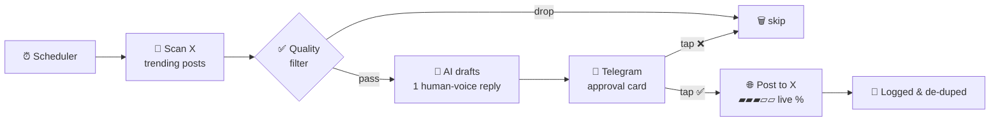
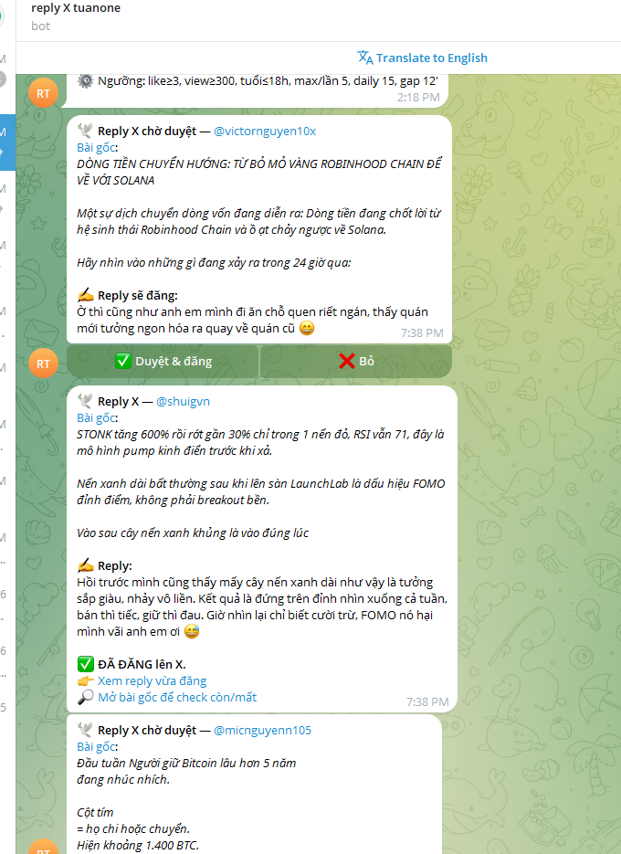

<h1 align="center">🤖 AI X Reply Assistant</h1>

<p align="center">
  <b>Find trending crypto posts on X · draft human-voice replies · you approve each one on Telegram</b><br/>
  <i>Tìm bài trend crypto trên X · soạn reply giọng người thật · bạn duyệt từng cái qua Telegram</i>
</p>

<p align="center">
  
  
  
</p>

<p align="center">
  <a href="https://hotlikeshop.com">🌐 hotlikeshop.com</a> ·
  <a href="https://hotlikeshop.com/ai">🔌 AI / MCP</a> ·
  <a href="https://t.me/hotlikesp">✈️ Telegram</a> ·
  <a href="https://zalo.me/0772868229">💬 Zalo</a>
</p>

> ⭐ **This is a public showcase.** It documents a tool I built and run in production. The source is **private / commercial** — want a custom bot for your own brand? [Ping me](#-contact--liên-hệ).
>
> ⭐ **Đây là repo giới thiệu (showcase).** Nó mô tả một công cụ mình đã xây &amp; đang chạy thật. Mã nguồn **private / thương mại** — muốn bot riêng cho thương hiệu của bạn? [Liên hệ mình](#-contact--liên-hệ).

---

## 🇬🇧 What it does

Not a blind spam bot. A **human-in-the-loop assistant** that saves you hours of manual community engagement while keeping *you* in control of every reply.

1. **Discover** — scans X for trending crypto/finance posts by keyword (Latest), through a real logged-in browser session.
2. **Filter** — drops low-quality posts (too few likes/views, too old, off-topic, scam/giveaway, sensitive topics, wrong language).
3. **Draft** — an LLM writes **one** natural, "buddy-voice" reply per post. Rotating styles (agree / curious question / personal take / gentle counter / playful / hype) + an *anti-repetition* opener ban → sounds like a real person, never templated.
4. **Approve** — each draft is pushed to a **private Telegram bot**. You tap ✅ to post or ❌ to skip. A live **progress bar** shows exactly what's happening while it posts.
5. **Stay safe** — daily cap, minimum gap between replies, de-dup (never reply twice to one post), and a one-command **kill-switch**.

## 🇻🇳 Bot làm gì

Không phải bot spam mù. Đây là **trợ lý có người duyệt** (human-in-the-loop) — tiết kiệm hàng giờ tương tác cộng đồng thủ công mà **bạn vẫn kiểm soát từng comment**.

1. **Quét** — tìm bài trend crypto/tài chính trên X theo từ khóa (tab Latest), qua trình duyệt thật đã đăng nhập.
2. **Lọc** — bỏ bài kém chất lượng (ít like/view, quá cũ, lạc chủ đề, scam/giveaway, chủ đề nhạy cảm, sai ngôn ngữ).
3. **Soạn** — AI viết **1** reply tự nhiên giọng "anh em" cho mỗi bài. Xoay vòng phong cách (đồng tình / hỏi tò mò / trải nghiệm / phản biện nhẹ / đùa vui / hype) + cấm mở bài lặp khuôn → nghe như người thật, không máy móc.
4. **Duyệt** — mỗi draft đẩy về **bot Telegram riêng**. Bạn bấm ✅ để đăng hoặc ❌ để bỏ. **Thanh tiến trình %** cho biết đang chạy tới đâu khi đăng.
5. **An toàn** — giới hạn/ngày, giãn cách tối thiểu giữa 2 reply, chống trùng (không reply lại 1 bài), và **kill-switch** tắt ngay bằng 1 lệnh.

---

## 🔁 How it works — Luồng hoạt động



**Telegram approval — live progress while posting / thanh tiến trình khi đăng:**

```
▰▰▰▱▱▱▱▱▱▱ 15% — Opening browser…
▰▰▰▰▱▱▱▱▱▱ 40% — Opening original post…
▰▰▰▰▰▱▱▱▱▱ 55% — Waiting for composer…
▰▰▰▰▰▰▰▱▱▱ 70% — Typing reply…
▰▰▰▰▰▰▰▰▱▱ 88% — Sending…
▰▰▰▰▰▰▰▰▰▰ 100% — Posted ✅
```

<!-- Ảnh thật: thả screenshot Telegram vào docs/ rồi nhúng ở đây, vd:

-->

---

## 🎬 Demo

[](https://www.youtube.com/watch?v=ApsUdfstSFM)

<p align="center"><i>&#9654;&#65039; Full approve &rarr; post walkthrough / Toan bo qua trinh duyet &rarr; dang &mdash; <a href="https://www.youtube.com/watch?v=ApsUdfstSFM">watch on YouTube</a></i></p>

<!-- Anh that: tha screenshot Telegram vao docs/ roi bo dau comment dong duoi:

-->

## ✨ Highlights — Điểm nổi bật

| | EN | VI |
|--|----|----|
| 👤 | **Human approval** on every reply | **Người duyệt** từng reply |
| 🗣️ | Natural buddy-voice, 6 rotating styles, anti-repeat | Giọng "anh em" tự nhiên, 6 phong cách xoay vòng, chống lặp |
| 🧹 | Smart quality + scam/off-topic filter | Lọc chất lượng + scam/lạc chủ đề |
| 📊 | Live % progress in Telegram | Thanh tiến trình % ngay trên Telegram |
| 🛡️ | Rate-limit · daily cap · de-dup · kill-switch | Giới hạn · cap/ngày · chống trùng · kill-switch |
| 🌐 | Bilingual, LOCAL-first for account safety | Song ngữ, ưu tiên chạy LOCAL cho an toàn tài khoản |

---

## 💼 Want this for your brand? — Muốn dùng cho thương hiệu của bạn?

I build **AI-native commerce &amp; automation**: MCP servers, content engines, social auto-reply assistants, on-chain trackers. The source of this bot is private — but I can tailor one to your niche, voice, and workflow.

Mình làm **thương mại &amp; tự động hoá bằng AI**: MCP server, máy viết nội dung, trợ lý auto-reply mạng xã hội, theo dõi dòng tiền on-chain. Mã bot này để private — nhưng mình dựng bản riêng theo lĩnh vực, giọng văn &amp; quy trình của bạn.

### 🔗 My work / Dự án của mình
- 🛒 **[hotlikeshop.com](https://hotlikeshop.com)** — AI-native store: MMO / social accounts, proxies &amp; digital services.
- 🔌 **[hotlikeshop.com/ai](https://hotlikeshop.com/ai)** — buy directly from your AI assistant (Claude, Cursor, ChatGPT) via **MCP** · [`hotlikeshop-mcp`](https://github.com/tuanone123/hotlikeshop-mcp).

### 📬 Contact — Liên hệ
- ✈️ Telegram: **[@hotlikesp](https://t.me/hotlikesp)**
- 💬 Zalo: **[0772868229](https://zalo.me/0772868229)**
- 🆘 Support: **[hotlikeshop.com/support](https://hotlikeshop.com/support)**

> 💡 Like it? **Follow &amp; ⭐ star** — it helps, and you'll catch the next tool I ship.
> Thấy hay? **Follow &amp; ⭐ star** repo nhé — vừa ủng hộ, vừa hóng bản kế tiếp.

---

<p align="center"><sub>Built with Python · Playwright · LLMs · Telegram — human-in-the-loop by design.</sub></p>
